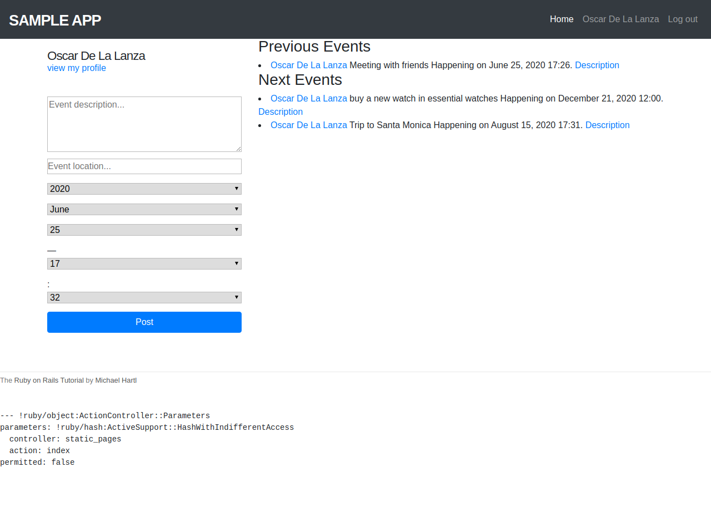

# Private Events

> Basic usage of Rails routes, controller, models, views and sessions.
> This is a project for practice with associations and active record by creating an app with a similar functionality of 
> Eventbrite

**Assignment page** - [The Odin Project](https://www.theodinproject.com/courses/ruby-on-rails/lessons/associations)

### Technology

Ruby - Rails - ActiveRecord - PostgreSQL - SQLite 

## Getting Started

> To get a local copy up and running follow these simple example steps.

### Prerequisites

- `Git`
- `Ruby 2.6.5`
- `Rails 6`

### Setup

To clone the project in your local environment do the following

- Open a new `terminal` window and navigate to the directory where the project will be stored
- Run the command `git clone git@github.com:oscardelalanza/mv-rails-05-private-events.git`
- Run the command `cd mv-rails-05-private-events` to enter the project directory

### Install

- Install the required gems running the command `bundle install --without production`
- Install the required node modules running the command `yarn install`
- Create and migrate the database running the command `rails db:migrate`

### Usage

- Click on `Sign up now!` and fill the form to create your account

#### Nav bar links

- Click on `Home` to navigate to the home page
- Click on `user` to navigate to the user profile
- Click on `Log out` to end your session

#### Create Events

- Fill the `form` in the left part oh the home page with your event `description`, `location`, `date` and `hour`
- Once you post your Event, it will be displayed on the right list of the home page. Notice that depending on the event date,
it will be classified as `previous` or `next` event.

### Run tests

### Deployment

### Installation
- `bundle --without production`
- `yarn install --check-files`
- `rails db:migrate` 
- `rails db:seed`

### Star development server
- `rails server`

### Rails console
- `rails console`

### Integration tests
- `rails tests`

### Authors

👤 **Oscar De La Lanza**

- Github: [@oscardelalanza](https://github.com/oscardelalanza)
- Twitter: [@oscardelalanza](https://twitter.com/oscardelalanza)
- Linkedin: [Oscar De La Lanza](https://www.linkedin.com/in/oscardelalanza/)
- Email: oscardelalanza@gmail.com

👤 **Tiago Ferreira** 
- [@ferreirati](https://github.com/ferreirati)
